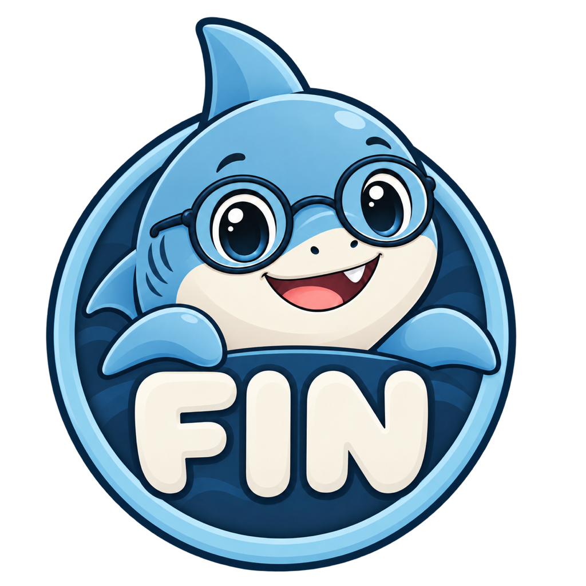
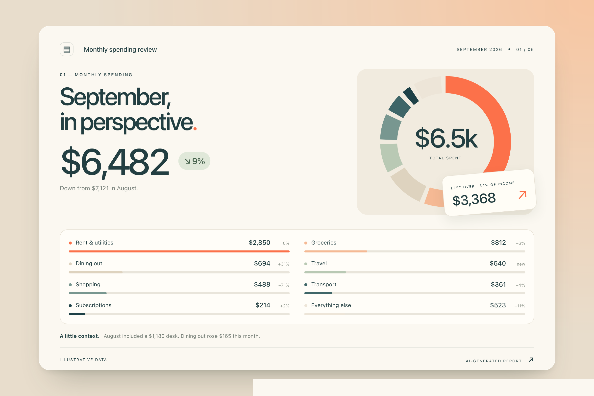
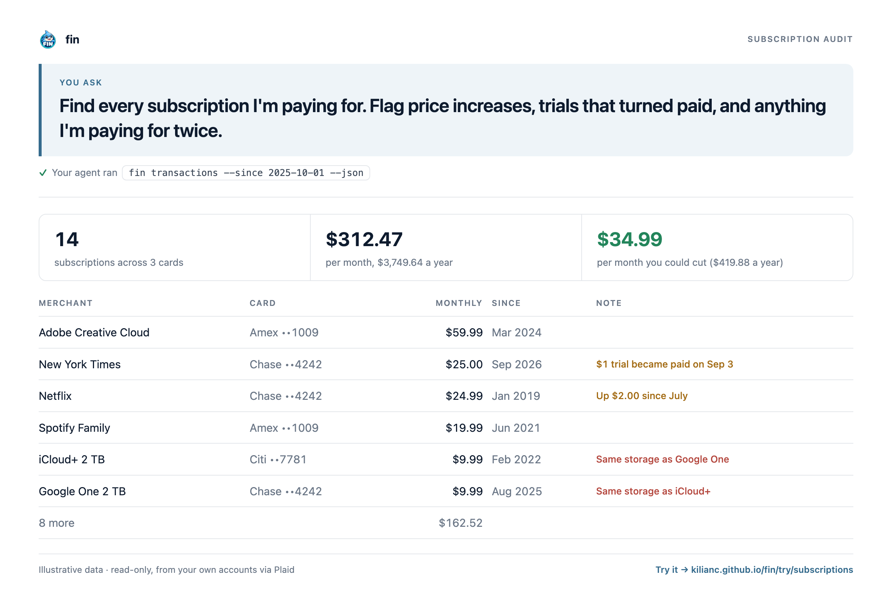
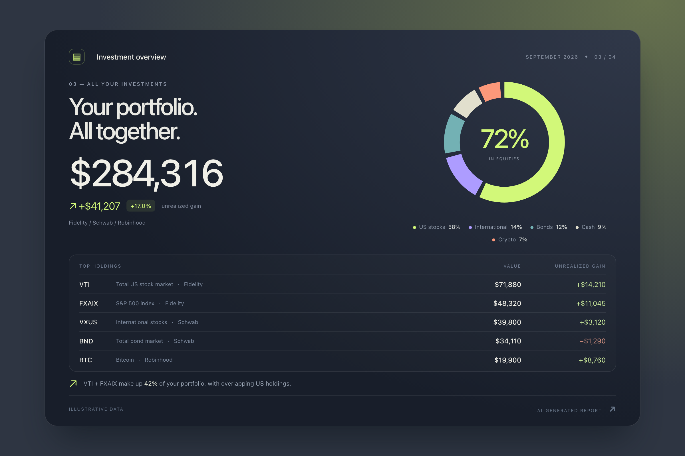
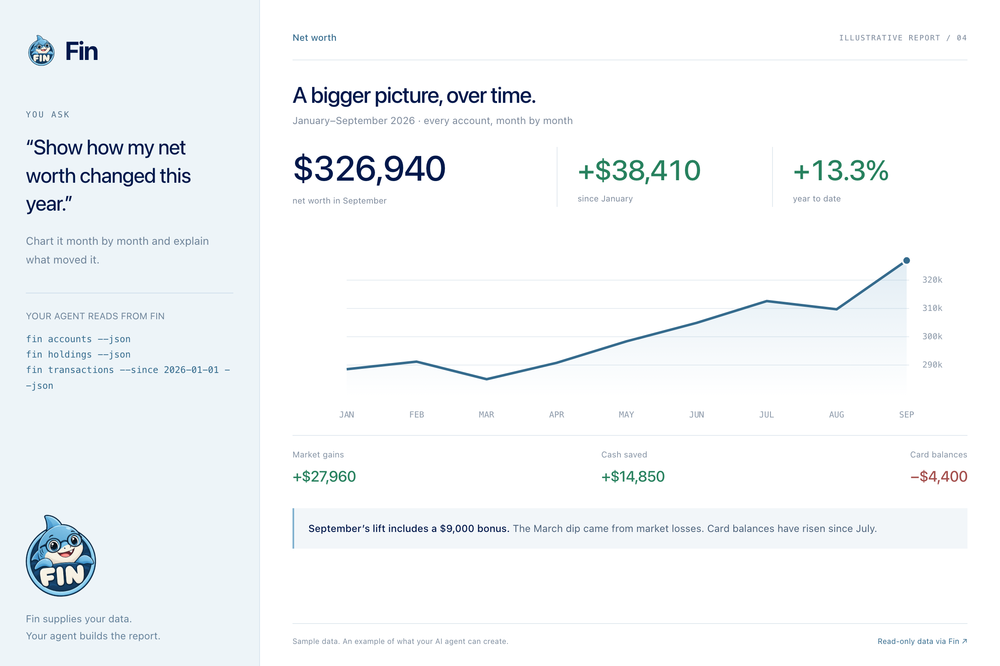

<p align="center"></p>

# fin

**A CLI for your financial data, built for the AI era.**

fin is a local, read-only tool for you and your AI agents: your financial data
goes from Plaid straight to this machine, your keys stay in your macOS
Keychain, and you own all of it end to end.

```text
$ fin accounts
Accounts · 18 across 6 Items
╭──────────────────┬──────────────────────┬──────┬──────────────────┬──────────┬───────────┬───────────╮
│ Item             │ Account              │ Mask │ Type             │  Current │ Available │     Limit │
├──────────────────┼──────────────────────┼──────┼──────────────────┼──────────┼───────────┼───────────┤
│ chase            │ Sapphire Preferred   │ 4242 │ credit card      │  1834.12 │  13165.88 │  15000.00 │
│ fidelity         │ Roth IRA             │ 0917 │ roth investment  │ 48210.55 │           │           │
╰──────────────────┴──────────────────────┴──────┴──────────────────┴──────────┴───────────┴───────────╯
```

There is no server, no account with anyone but Plaid, and nothing to deploy.
fin talks to Plaid's API from your laptop and prints the answer. In a terminal
you get tables; when an agent such as Claude runs it, it gets JSON.

## What you can ask

fin supplies the data; your agent creates the layout, charts, and analysis.
These AI-generated reports use illustrative data. Each "Try it" link opens
the prompt in Claude Code or Codex.

<table>
<tr>
<td width="50%" valign="bottom">
<p><b>“Build me a monthly spending review.”</b><br>Compare it to the month before.<br><a href="https://kilianc.github.io/fin/try/spending/">Try it in Claude Code or Codex →</a></p>
<a href="https://kilianc.github.io/fin/try/spending/"></a>
</td>
<td width="50%" valign="bottom">
<p><b>“Find the subscriptions worth reviewing.”</b><br>Find subscriptions, price increases, and anything I’m paying for twice.<br><a href="https://kilianc.github.io/fin/try/subscriptions/">Try it in Claude Code or Codex →</a></p>
<a href="https://kilianc.github.io/fin/try/subscriptions/"></a>
</td>
</tr>
<tr>
<td width="50%" valign="bottom">
<p><b>“Put all my investments in one report.”</b><br>Show my allocation and unrealized gains across brokerages.<br><a href="https://kilianc.github.io/fin/try/portfolio/">Try it in Claude Code or Codex →</a></p>
<a href="https://kilianc.github.io/fin/try/portfolio/"></a>
</td>
<td width="50%" valign="bottom">
<p><b>“Show how my net worth changed this year.”</b><br>Chart it month by month and explain what moved it.<br><a href="https://kilianc.github.io/fin/try/net-worth/">Try it in Claude Code or Codex →</a></p>
<a href="https://kilianc.github.io/fin/try/net-worth/"></a>
</td>
</tr>
</table>

## No agent? Use SQL or a spreadsheet

fin keeps your transactions and balances in a DuckDB file on your Mac.
`fin sync` brings it up to date and `fin sql` queries it, read-only:

```text
$ fin sql "select category, sum(amount) as spent from transactions
           where amount > 0 and date >= '2026-09-01' group by 1 order by 2 desc"
```

Or run `fin sheet`, and fin keeps a Google Sheet in your Drive with the same
data, a Transactions tab and an Accounts tab, ready for pivot tables and
charts. Run it again to refresh. fin can see that one spreadsheet and nothing
else in your Drive.

### Itemize Amazon orders (experimental)

One Amazon charge often pays for things in several categories. `fin amazon
login home` copies your amazon.com sign-in from Chrome, reads your Amazon
payments and order pages, and matches each card charge to the order it paid
for. Each item comes with what it cost, its share of tax and shipping
included, and your agent categorizes them (`fin amazon categorize`):

```text
$ fin sql "select m.transaction_id, i.title, i.cost
           from amazon_matches m join amazon_items i
             on list_contains(m.order_ids, i.order_id)
           where m.match = 'exact'"
```

This uses amazon.com's own website endpoints with your session. Amazon offers
no API for it and its Conditions of Use do not allow it, so it can break or be
blocked at any time. US amazon.com only. See `fin help amazon`.

## What you need

- A Mac. fin keeps your keys in the macOS Keychain.
- A free Plaid account on the Trial plan. `fin init` walks you through it.
- About 15 minutes, most of it signing in to your banks.

## Install

```bash
mkdir -p ~/.local/bin && curl -fsSL https://github.com/kilianc/fin/releases/latest/download/fin-darwin-universal.tar.gz | tar -xz -C ~/.local/bin
```

That downloads the latest [release](https://github.com/kilianc/fin/releases),
one binary for Apple Silicon and Intel Macs on macOS 12 or later, into
`~/.local/bin`; make sure that directory is on your `PATH`. Check it with
`fin --version`. Each release lists the tarball's SHA-256 in `SHA256SUMS`.

To build from source instead, you need [Go](https://go.dev/dl/) 1.26 or newer
and the Xcode Command Line Tools (`xcode-select --install`), because fin
embeds DuckDB through cgo:

```bash
go install github.com/kilianc/fin/cmd/fin@latest
```

## Get started

Let an AI agent do the setup. Pick one, read the prompt it opens with, and
press Enter:

<p>
  <a href="https://kilianc.github.io/fin/claude/"></a>
  &nbsp;
  <a href="https://kilianc.github.io/fin/codex/"></a>
</p>

The agent opens the pages, fills in the forms and brands Plaid Link with
fin's look. You do only what needs you: set your password, verify your email,
accept Plaid's terms, paste your secret key, and sign in to your banks. Claude
Code drives your browser through [Claude in Chrome](https://claude.com/chrome).

Using another agent? `fin init` shows what's done and what's next, and prints
the same prompt (`fin init --copy` puts it on your clipboard).

### Teach your agent fin

fin ships a [skill](plugins/fin/skills/fin/SKILL.md) that tells an agent when to reach for
fin, how to read its JSON, and what never to do without asking. In Claude
Code, install it as a plugin:

```text
/plugin marketplace add kilianc/fin
/plugin install fin@fin
```

Codex reads the same skill from `~/.agents/skills`:

```bash
curl -fsSL --create-dirs -o ~/.agents/skills/fin/SKILL.md https://raw.githubusercontent.com/kilianc/fin/main/plugins/fin/skills/fin/SKILL.md
```

If you'd rather do it yourself, here's the whole flow:

1. **Sign up for Plaid.** Go to <https://dashboard.plaid.com/signup> and choose
   personal use when asked. Verify your email.
2. **Get the free Trial plan.** Apply at
   <https://dashboard.plaid.com/trial-plan>. It's usually approved right away
   and lets you connect up to 10 institutions for free. Don't apply for full
   Production access: once you do, the Trial plan is no longer available.
3. **Save your keys.** Open <https://dashboard.plaid.com/developers/keys>, then:

   ```bash
   fin env production
   fin setup
   ```

   Paste the Client ID, then the Production secret (it stays hidden as you
   paste). fin checks them with Plaid and saves them in your Keychain.

   Or skip the pasting: if you use [Plaid's CLI](https://plaid.com/docs/resources/cli/),
   sign in with `plaid login` (and `plaid keys fetch` once the Trial plan is
   approved), then run `fin setup --from-plaid` to copy the keys it fetched
   into your Keychain.
4. **Give Plaid Link fin's look.** When you connect a bank, Plaid shows a
   consent screen; this puts fin's mascot and colors on it. It changes nothing
   about what data is shared.
   - Download [`mascot-plaid.png`](https://raw.githubusercontent.com/kilianc/fin/main/mascot-plaid.png),
     the 1024 × 1024 square logo with an opaque background.
   - Open <https://dashboard.plaid.com/link> (Customize → Link) and edit the
     customization named **default**; fin uses the default.
   - In its settings (gear icon, upper right), set the language to
     **English** and the countries to **United States only**. They must match
     what fin sends, or Plaid ignores the customization.
   - On the **Consent** pane choose **co-branded**, upload `mascot-plaid.png` as
     the logo, and set the brand color to Fin Blue **`#81B1CF`**.
   - Set the background color to **`#203A52`** to match the square logo, then click
     **Publish**.

   The consent screen will read "fin uses Plaid to connect your account"; the
   name comes from fin, so there's nothing to set for it.
5. **Connect your accounts**, one institution at a time:

   ```bash
   fin institutions citi        # is it supported?
   fin link --open              # connect it
   ```

   Plaid Link opens in your browser. Pick the institution and sign in; fin
   waits, then saves the connection. It asks for both transactions and
   investments, and gets whichever the institution supports, so banks,
   cards and brokerages all use the same command. Each connection gets a short name, such
   as `chase` or `american-express`, that the other commands use.
6. **Look around:**

   ```bash
   fin items                              # what's connected, and its health
   fin accounts                           # balances
   fin transactions --since 2026-01-01    # spending, newest first
   fin holdings                           # positions, cost basis, tax lots
   fin investments --since 2026-01-01     # buys, sells, dividends
   ```

### Your 10 slots

The Trial plan allows 10 connected institutions, and a slot stays used even if
you disconnect it, so pick them deliberately. `fin items` shows how many are
used, and `fin link` asks before using one. Check support with
`fin institutions <name>` first. Apple Card, for example, isn't available
through Plaid.

If a connection is ever missing a product it should have, add it without
using a new slot:

```bash
fin reconnect fidelity --add investments
fin reconnect charles-schwab --add transactions
```

### Once a year: reconnect

Many banks grant access for about a year. `fin items` shows each
connection's consent expiry and marks it `needs reconnect` when the bank wants
you to sign in again. Then run:

```bash
fin reconnect chase
```

You sign in again in Plaid Link, and the connection keeps its name, history
and slot.

## Security and privacy

- **Read-only.** fin asks Plaid only for transactions and investments data. It
  never requests account and routing numbers (Auth) or identity data, and it
  cannot move money.
- **Your keys stay in your Keychain.** The Plaid secret and the per-bank access
  tokens are stored only in the macOS Keychain, never in files, command-line
  arguments, environment variables or logs. fin writes them through
  `security -i` on stdin, so they never appear in a process listing.
- **No middleman.** Your data goes from Plaid's API to your machine and
  nowhere else, unless you run `fin sheet`, which writes it to a spreadsheet
  in your own Google Drive. fin has no server and no telemetry.
- **Local data is private.** `~/.config/fin/state.json` holds only names,
  institution IDs and sync times. Synced transactions and account balances
  live in a DuckDB file in `~/.local/share/fin`, one per environment
  (`production.duckdb`, `sandbox.duckdb`), kept out of `~/.config` so it
  never ends up in a dotfiles repo. Both are mode 0600; delete the
  `.duckdb` file to forget the history, and `fin sync` rebuilds it.
- **You stay in control of agents.** An agent can read your data through fin,
  but connecting a new institution needs you to sign in, and `fin link` will
  not use a slot without confirmation.

## Commands

| Command | What it does |
| --- | --- |
| `fin init [--copy]` | Status, next step, and a prompt for your AI agent |
| `fin env [sandbox\|production]` | Show or switch the Plaid environment (default sandbox) |
| `fin epoch [DATE]` | Show or set the first day of the finances fin reports on |
| `fin setup [--from-plaid]` | Save your Plaid keys in the Keychain, typed or imported from Plaid's CLI |
| `fin institutions <name>` | Check Plaid support before using a slot |
| `fin link [--open]` | Connect a new institution (`fin link brokerage` for investment-only ones) |
| `fin reconnect <item> [--add product]` | Sign in again, or add transactions or investments |
| `fin items` | Connections, slots used, consent expiry, health |
| `fin accounts [--live]` | Balances (`--live` asks each bank now, billed per call) |
| `fin transactions --since DATE [--until DATE] [--account X]` | Transactions |
| `fin sync` | Pull new and changed transactions into the local DuckDB file |
| `fin sql "<query>"` | Query the local file with DuckDB SQL, read-only |
| `fin paths [database]` | Where the state file and the DuckDB file are |
| `fin sheet [--open]` | Keep a Google Sheet with your transactions and balances |
| `fin amazon [login\|sync\|categorize\|logout]` | Itemize Amazon orders and split their charges by category (experimental) |
| `fin holdings [--account X]` | Positions with cost basis and tax lots |
| `fin investments --since DATE [--until DATE] [--account X]` | Investment transactions |

`--account` matches an account ID, the last four digits, or the account name.
`PLAID_ENV` overrides the environment set with `fin env` for one command or
shell. `FIN_CONFIG_DIR` moves the state file, and `FIN_DATA_DIR` moves the
DuckDB files (default `$XDG_DATA_HOME/fin`, or `~/.local/share/fin`).

## For AI agents

- When stdout is not a terminal, as when an agent runs it, `fin` prints JSON.
  Pass `--json` to force it. Check the `errors` array on every read. Exit code
  `3` means some Items failed but the data that succeeded is still there.
- An error with an `action` field, such as `"action": "run fin reconnect chase"`,
  needs the user. Tell them what to run; do not retry.
- Never run a production `fin link` without the user's explicit go-ahead in
  chat. Each one permanently uses a slot. Pass `--yes` only after they agree.
  Without a terminal, `fin link` stops with `CONFIRMATION_REQUIRED` instead of
  prompting.
- `fin link` and `fin reconnect` block until the user finishes in the browser.
  Run them in the background and read the Hosted Link URL from stderr.
- Transaction amounts use Plaid's sign: positive means money left the account
  (a purchase or payment), negative means money came in (a refund or deposit).
- Prefer `authorized_date` over `date` when it is set. Pending transactions
  can still change.
- `fin transactions` and `fin sync` ask Plaid only for what changed since the
  last sync and keep the result in a local DuckDB file. For anything beyond a
  date range, run `fin sync` once, then as many `fin sql` queries as you need.

### `fin items`

```json
{
  "env": "production",
  "slots_used": 2,
  "slots_total": 10,
  "items": [
    {
      "name": "chase",
      "item_id": "eVBnVMp7zdTJLkRNr33Rs6zr7KNJqBFL9DrE6",
      "institution": "Chase",
      "kind": "bank",
      "products": ["transactions"],
      "linked_at": "2026-10-09T18:02:11Z",
      "health": "ok",
      "error": null,
      "consent_expires_at": "2027-10-09T18:02:00Z",
      "last_successful_update": {"transactions": "2026-10-09T11:58:00Z"},
      "last_sync": "2026-10-09T12:00:03Z"
    },
    {
      "name": "fidelity",
      "item_id": "dVzbVMLjrxTnLjX4G66XUp5GLklm4oiPnyxl8",
      "institution": "Fidelity",
      "kind": "brokerage",
      "products": ["investments"],
      "linked_at": "2026-10-09T18:10:40Z",
      "health": "needs_reconnect",
      "error": {
        "item": "fidelity",
        "item_id": "dVzbVMLjrxTnLjX4G66XUp5GLklm4oiPnyxl8",
        "institution": "Fidelity",
        "code": "ITEM_LOGIN_REQUIRED",
        "message": "Fidelity needs you to sign in again; run `fin reconnect fidelity`",
        "action": "run fin reconnect fidelity"
      },
      "action": "run fin reconnect fidelity",
      "consent_expires_at": null,
      "last_successful_update": {"investments": "2026-10-02T09:14:00Z"},
      "last_sync": null
    }
  ],
  "errors": []
}
```

`health` is `ok`, `needs_reconnect`, `error`, or `unknown` when `/item/get`
itself failed.

### `fin accounts [--live]`

```json
{
  "accounts": [
    {
      "item": "chase",
      "institution": "Chase",
      "account_id": "BxBXxLj1m4HMXBm9WZZmCWVbPjX16EHwv99vp",
      "name": "Sapphire Preferred",
      "official_name": null,
      "mask": "4242",
      "type": "credit",
      "subtype": "credit card",
      "balances": {
        "available": 13165.88,
        "current": 1834.12,
        "limit": 15000,
        "iso_currency_code": "USD",
        "unofficial_currency_code": null
      }
    }
  ],
  "env": "production",
  "errors": [
    {
      "item": "fidelity",
      "item_id": "dVzbVMLjrxTnLjX4G66XUp5GLklm4oiPnyxl8",
      "institution": "Fidelity",
      "code": "ITEM_LOGIN_REQUIRED",
      "message": "Fidelity needs you to sign in again; run `fin reconnect fidelity`",
      "action": "run fin reconnect fidelity"
    }
  ],
  "live": false
}
```

That run exits with code `3`, because Fidelity failed.

### `fin transactions --since DATE [--until DATE] [--account X]`

`--until` defaults to today. `--account` matches an `account_id`, the last
four digits (`mask`), or the account name. Results are newest first.

```json
{
  "account": "",
  "env": "production",
  "errors": [],
  "since": "2026-09-01",
  "sync": [
    {"item": "chase", "transactions_update_status": "HISTORICAL_UPDATE_COMPLETE", "changed": 3, "removed": 1, "last_sync": "2026-10-09T12:00:03Z"}
  ],
  "transactions": [
    {
      "transaction_id": "lPNjeW1nR6CDn5okmGQ6hEpMo4lLNoSrzqDje",
      "item": "chase",
      "institution": "Chase",
      "account_id": "BxBXxLj1m4HMXBm9WZZmCWVbPjX16EHwv99vp",
      "account_name": "Sapphire Preferred",
      "account_mask": "4242",
      "date": "2026-10-07",
      "authorized_date": "2026-10-06",
      "name": "WHOLEFDS MKT 10234",
      "merchant_name": "Whole Foods Market",
      "amount": 84.17,
      "iso_currency_code": "USD",
      "pending": false,
      "category": "FOOD_AND_DRINK",
      "category_detailed": "FOOD_AND_DRINK_GROCERIES",
      "payment_channel": "in store"
    }
  ],
  "until": "2026-10-09"
}
```

`TRANSACTIONS_NOT_READY` in `errors` means Plaid is still pulling a newly
linked Item's history. Try again in a few minutes.

### `fin sql "<query>"`

Runs one query against the data `fin sync` saved. The database is opened
read-only with DuckDB's external access turned off, so a query can't change
it or read or write other files. Tables: `transactions`, `accounts` (latest
balances) and `items` (sync time per connection); `fin help sql` lists the
columns.

```bash
fin sql "select category, sum(amount) as spent from transactions
         where amount > 0 and date >= '2026-09-01' group by all order by spent desc"
```

```json
{
  "env": "production",
  "columns": ["category", "spent"],
  "rows": [
    {"category": "FOOD_AND_DRINK", "spent": 612.4},
    {"category": "TRANSPORTATION", "spent": 188.15}
  ],
  "synced": [
    {"item": "chase", "item_id": "eVBnVMp7zdTJLkRNr33Rs6zr7KNJqBFL9DrE6", "transactions_update_status": "HISTORICAL_UPDATE_COMPLETE", "last_sync": "2026-10-09T12:00:03Z"}
  ]
}
```

The file also opens in the `duckdb` CLI (`duckdb "$(fin paths database)"`)
when no fin command is writing to it.

### `fin sheet [--open] [--new] [--login]`

For people who'd rather use a spreadsheet than SQL. The first run signs in to
Google in your browser, with the `drive.file` permission only: fin can create
spreadsheets and edit the ones it created, and can't see anything else in your
Drive. Each run syncs, then rewrites the **Transactions** and **Accounts** tabs
of a spreadsheet named "fin". Add your own tabs for charts and formulas; fin
leaves them alone. Values are written raw, so a merchant name can never run as
a formula. `--new` starts a fresh spreadsheet, `--login` signs in again.

### `fin holdings [--account X]`

```json
{
  "env": "production",
  "errors": [],
  "holdings": [
    {
      "item": "fidelity",
      "institution": "Fidelity",
      "account_id": "JqMLm4rJwpF6gMPJwBqdh9ZjjPvvpDcb7kDK1",
      "account_name": "Roth IRA",
      "security_id": "d6ePmbPxgWCWmMVv66q9iPV94n91vMtov5Are",
      "ticker": "VTI",
      "security_name": "Vanguard Total Stock Market ETF",
      "security_type": "etf",
      "quantity": 42.5,
      "price": 301.12,
      "price_as_of": "2026-10-08",
      "value": 12797.6,
      "cost_basis": 9875.4,
      "iso_currency_code": "USD",
      "tax_lots": [
        {
          "institution_lot_id": "L-0001",
          "original_purchase_datetime": "2023-03-14T00:00:00Z",
          "quantity": 42.5,
          "purchase_price": 232.36,
          "cost_basis": 9875.4,
          "current_value": 12797.6,
          "position_type": "LONG"
        }
      ]
    }
  ]
}
```

`tax_lots` is an empty list when the institution does not report lots.
`cost_basis` can be `null`.

### `fin investments --since DATE [--until DATE] [--account X]`

```json
{
  "account": "",
  "env": "production",
  "errors": [],
  "investment_transactions": [
    {
      "investment_transaction_id": "pK99jB3e2Gt4KqLWvZeMhkdRZNoWqKF1qn6Gb",
      "item": "schwab",
      "institution": "Charles Schwab",
      "account_id": "k67E4xKvMlhmleEa4pg9hlwGGNnnEeixPolGm",
      "account_name": "Individual Brokerage",
      "date": "2026-09-15",
      "name": "BUY VTI",
      "type": "buy",
      "subtype": "buy",
      "security_id": "d6ePmbPxgWCWmMVv66q9iPV94n91vMtov5Are",
      "ticker": "VTI",
      "security_name": "Vanguard Total Stock Market ETF",
      "quantity": 5,
      "price": 298.4,
      "amount": 1492,
      "fees": 0,
      "iso_currency_code": "USD"
    }
  ],
  "since": "2026-09-01",
  "until": "2026-10-09"
}
```

### Errors

```json
{
  "error": {
    "code": "NOT_CONFIGURED",
    "message": "Plaid production credentials are not in the Keychain; run `fin setup` in a terminal"
  }
}
```

Common codes:

| Code | Meaning |
| --- | --- |
| `USAGE` | Bad arguments (exit 2) |
| `NOT_CONFIGURED` | The user needs to run `fin setup` in a terminal |
| `NO_LOCAL_DATA` | Nothing synced yet; run `fin sync` before `fin sql` |
| `SQL_ERROR` | DuckDB rejected the query; the message says why |
| `STORE_BUSY` | Another fin command is writing the local file; try again |
| `ITEM_NOT_FOUND` | No Item by that name; `details.items` lists the names |
| `CONFIRMATION_REQUIRED` | A production link needs the user's go-ahead, then `--yes` |
| `NO_SLOTS` | All 10 production slots are used |
| `LINK_TIMEOUT`, `LINK_EXITED`, `LINK_FAILED` | Link did not add an Item |
| `RECONNECT_INCOMPLETE` | Link finished but the Item is still unhealthy |
| `GOOGLE_SIGNIN_EXPIRED` | Google no longer accepts fin's sign-in; run `fin sheet --login` |
| `GOOGLE_SIGNIN_CANCELLED` | The user declined Google sign-in |
| `GOOGLE_SHEETS_ERROR` | The Sheets API failed; the message says why |
| `AMAZON_SIGNIN_EXPIRED` | Amazon dropped the sign-in; sign in in Chrome, then `fin amazon login <name>` |
| `AMAZON_RATE_LIMITED` | Amazon is limiting requests; what was read is saved, `fin amazon sync` later |
| `PROFILE_REQUIRED` | Several Chrome profiles are signed in to Amazon; `details.profiles` lists them for `--profile` |
| Plaid codes such as `INVALID_API_KEYS` | Passed through, with `details.request_id` |

## Development

```bash
make build       # universal macOS binary at bin/fin (VERSION=0.2.0 to stamp it)
make release VERSION=0.2.0   # test, build, tag v0.2.0, upload and verify; rerun to resume
make test        # unit tests against a fake Plaid client
make e2e         # end-to-end run against the real Plaid sandbox
make docs        # regenerate setup, try, and privacy pages from their source
make gallery     # re-render the four approved AI-generated report previews
```

The report artwork lives in `docs/examples/index.html` and
`docs/examples/reports.css`. Run `make gallery` after editing it; the landing
page, all four try pages, social previews, and this README share the resulting
`docs/examples/1.png` through `4.png` files. Try-page prompts and descriptions
live in `internal/fin/examples.go`; run `make docs` after changing them.

The end-to-end script needs sandbox keys (`PLAID_ENV=sandbox fin setup`). It
uses a temporary state directory, links two sandbox Items without the Link UI,
exercises every read command, forces an `ITEM_LOGIN_REQUIRED` to check that
one broken Item doesn't hide the others, and removes its sandbox tokens from
the Keychain when it exits.

`FIN_DEBUG=1` prints what Plaid Link reports on each poll, without tokens.

## Brand

The report gallery shows independent AI-generated reports. Keep fin branding,
prompts, and app sidebars out of the report artwork; questions and try links
belong in the surrounding page. Each report can have its own visual style.


The approved artwork is `mascot.png` (transparent circular badge) and
`mascot-plaid.png` (opaque square), both 1024 × 1024. The terminal mascot is
embedded in the binary; after updating `mascot.png`, run `make mascot` with
Python 3 and Pillow installed to regenerate its color and monochrome versions.

Fin the shark is the mascot, and the colors come from it, softened so they are
easy on the eyes:

| Name | Hex | Where it comes from | Used for |
| --- | --- | --- | --- |
| Fin Blue | `#81B1CF` | the shark's body | the brand color: wordmark, titles, table headers |
| Fin Deep | `#356B8D` | the shark's shading | Fin Blue on light terminals |
| Fin Navy | `#00184B` | the badge | backgrounds and dark accents |
| Fin Glow | `#8CD9D6` | the badge ring | highlights, sparingly |

Green (`#3FB97A`) is reserved for meaning: money in, gains, and healthy
connections.

## License

[MIT](LICENSE)

## Not built yet

- The local DuckDB file holds transactions and account balances only.
  Holdings and investment transactions are still read live from Plaid.
